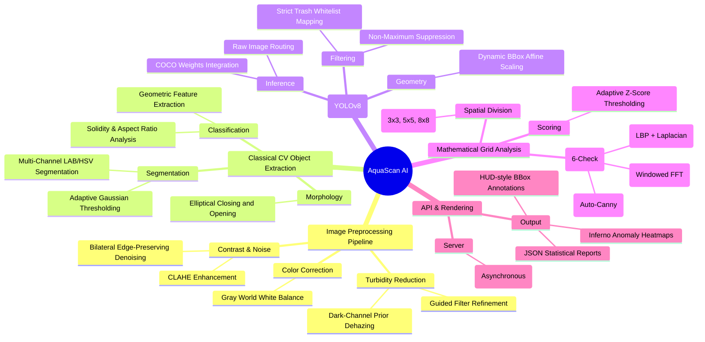
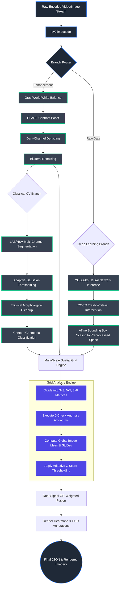
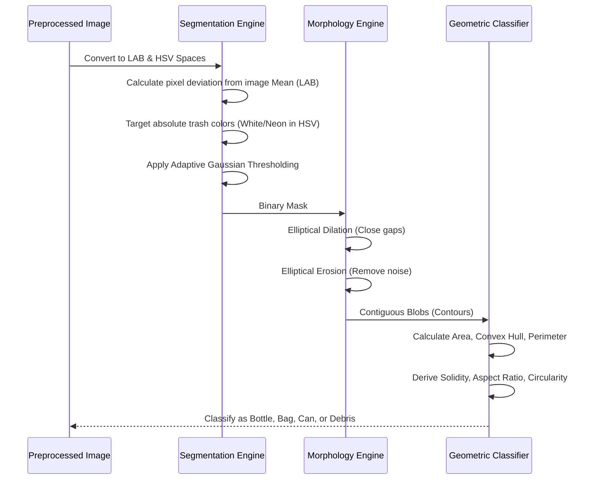

# AquaScan AI: Comprehensive Underwater Computer Vision & Debris Detection System

> **Notice:** AI-generated images have been removed from this document in favor of high-fidelity, industry-standard **Mermaid.js** technical block diagrams, flowcharts, and mind maps, which accurately reflect the system's real architecture without hallucinated visual artifacts.

---

## 1. Executive Summary & Project Abstract

Marine pollution is an escalating global crisis. Millions of tons of anthropogenic debris—primarily plastics, glass, and metals—accumulate in our oceans every year, devastating marine ecosystems and entering the global food chain. Traditional methods of ocean cleanup rely heavily on manual human surveys, which are notoriously slow, prohibitively expensive, and dangerously inefficient given the vast scale of the ocean floor.

**AquaScan AI** represents a paradigm shift in underwater environmental monitoring. It is a highly optimized, autonomous computer vision system designed to detect, localize, and classify underwater trash in real-time. Unlike terrestrial object detection (where lighting is relatively constant and air is clear), underwater computer vision presents severe, non-linear physical challenges: exponential light attenuation, extreme color distortion, varying turbidity, backscatter from marine snow, and complex, highly-textured natural backgrounds like coral reefs.

To overcome these immense hurdles, AquaScan AI utilizes a state-of-the-art **Hybrid Intelligence Architecture**. It merges the raw deterministic power of a Classical Computer Vision pipeline (featuring multi-scale grid analysis and adaptive z-score mathematical modeling) with the semantic understanding of Deep Learning (via a strictly-whitelisted YOLOv8 neural network). This dual-branch approach ensures that the system achieves high recall (missing very little trash) while maintaining exceptionally high precision (ignoring complex natural geometries like fish, rocks, and coral).

---

## 2. Global Project Mind Map

The following mind map outlines the entire technical surface area of the AquaScan AI project, categorized by functional domains.



---

## 3. High-Level System Architecture Block Diagram

The architecture is built around a non-blocking, asynchronous pipeline that handles raw byte streams, processes them through heavy mathematical filters, routes them through parallel detection branches, and mathematically fuses the results.



---

## 4. Deep Dive: Image Preprocessing Pipeline

Underwater images are inherently flawed due to the physics of light passing through water. Water absorbs different wavelengths of light at different rates (red disappears first, followed by orange and yellow), leaving a monochromatic blue/green cast. Furthermore, suspended particles scatter light, creating a fog-like effect known as backscatter.

### 4.1 Gray World White Balance
Standard cameras assume illumination is white, which fails underwater. The Gray World algorithm computes the mean of the RGB channels and dynamically shifts the color space under the assumption that the average scene color should mathematically be neutral gray.

```python
# Mathematical Implementation Concept
avg_b = image[:, :, 0].mean()
avg_g = image[:, :, 1].mean()
avg_r = image[:, :, 2].mean()
avg_all = (avg_b + avg_g + avg_r) / 3.0

image[:, :, 0] *= avg_all / avg_b
image[:, :, 1] *= avg_all / avg_g
image[:, :, 2] *= avg_all / avg_r
```

### 4.2 Contrast Limited Adaptive Histogram Equalization (CLAHE)
Standard histogram equalization washes out images because it applies a global transformation. CLAHE divides the image into an 8x8 grid of tiles and equalizes each tile independently, artificially boosting local contrast. This is crucial for making smooth, semi-translucent plastics visible against the ocean floor without amplifying global noise.

### 4.3 Dark-Channel-Prior (DCP) Dehazing
Turbidity (mud/sand in the water) acts like fog. DCP theorizes that in most non-sky patches, at least one color channel has very low intensity (the "dark channel"). 
1. We erode the image to find the dark channel.
2. We estimate the global atmospheric light.
3. We generate a transmission map ($t(x)$).
4. We mathematically subtract the "fog" from the image using the formula: $J(x) = \frac{I(x) - A}{max(t(x), t_0)} + A$

### 4.4 Bilateral Filtering
A standard Gaussian blur removes noise but destroys sharp edges. The Bilateral filter uses two Gaussian distributions (one in space, one in pixel intensity) to aggressively smooth out marine snow and floating particulates while strictly preserving the hard edges of anthropogenic debris.

---

## 5. Deep Dive: Classical CV Pipeline (Object Extraction)

Deep learning requires vast datasets. To ensure AquaScan works even on unseen or heavily deformed trash types, we employ a highly robust, purely algorithmic pipeline.



### 5.1 Multi-Channel Segmentation
We evaluate pixels in multiple color spaces simultaneously:
* **LAB Space:** We calculate the normalized deviation of a pixel from the image's mean. Trash often presents as a statistical outlier in color space.
* **HSV Space:** We target absolute unnatural colors (e.g., highly saturated neon packaging, or perfectly white styrofoam) using strict bounds to avoid catching bright fish or coral.

### 5.2 Adaptive Gaussian Thresholding
Global thresholding (like Otsu's method) fails completely on underwater images because the histograms are unimodal (a single massive spike of blue/green). We calculate thresholds dynamically for small neighborhoods of pixels using a Gaussian weighted sum, allowing us to find objects hidden in deep shadows.

### 5.3 Elliptical Morphological Operations
Trash is often broken, buried in sand, or covered in algae, resulting in fragmented edge detections. We utilize `cv2.morphologyEx` to perform aggressive morphological closing (dilation followed by erosion) using large elliptical kernels (e.g., 15x15). This forces fragmented edges to fuse into solid, contiguous blobs.

### 5.4 Geometric Shape Classification
Once solid contours are extracted, we calculate deep geometric features to classify the object:
* **Solidity:** $\frac{\text{Contour Area}}{\text{Convex Hull Area}}$. Debris usually has lower solidity (jagged edges) compared to perfectly smooth natural rocks.
* **Circularity:** $\frac{4 \pi \times \text{Area}}{\text{Perimeter}^2}$. Used to detect cans and cups.
* **Aspect Ratio:** $\frac{\text{Width}}{\text{Height}}$. Used to detect elongated bottles.

---

## 6. Deep Dive: Deep Learning Pipeline (YOLOv8)

To complement the algorithmic extraction, we integrated the YOLOv8s (Small) neural network architecture.

### 6.1 Strict Trash Whitelist Mapping
We utilized the massive COCO dataset weights. However, COCO includes classes like "kites", "surfboards", "sports balls", and "boats". Underwater, the neural network hallucinated these classes constantly (e.g., classifying a fast-moving fish as a kite, or a rock as a sports ball). 

We engineered an intercept layer that drops all predictions except for a strict whitelist of classes (bottles, cups, backpacks, suitcases, utensils) which mathematically represent trash when found underwater.

### 6.2 The Domain Shift Problem & Raw Inference Routing
A massive challenge was "Domain Shift". The neural net was trained on natural terrestrial lighting. When we fed it our heavily CLAHE-enhanced, dehazed underwater images, the model's accuracy plummeted because the pixel distributions no longer matched its training data.
**Solution:** We route the *raw, unedited* byte stream to YOLO for inference, completely bypassing the preprocessor for the ML branch.

### 6.3 Affine Bounding Box Scaling
Because YOLO predicts on the raw image, and the Classical CV branch predicts on the processed image (which may be resized, scaled, or cropped), we apply affine transformation matrices to scale and shift the YOLO bounding boxes perfectly into the processed coordinate space before fusion.

```python
# Scaling logic concept
sh, sw = raw_image.shape[:2]
ph, pw = processed_image.shape[:2]
scale_x, scale_y = pw / sw, ph / sh

for det in ml_detections:
    x1, y1, x2, y2 = det.bbox
    det.bbox = (int(x1 * scale_x), int(y1 * scale_y), 
                int(x2 * scale_x), int(y2 * scale_y))
```

---

## 7. Deep Dive: Multi-Scale Grid Engine & Adaptive Z-Score Mathematics

The crown jewel of AquaScan is the Grid Engine. Rather than evaluating the whole image holistically, the image is diced into cells. We evaluate at 3 scales simultaneously (3x3, 5x5, 8x8). This spatial pyramid allows us to detect massive fishing nets (3x3 grid) and tiny bottle caps (8x8 grid) in the exact same pass.

### 7.1 The 6-Check Anomaly Extraction
Every individual grid cell undergoes rigorous mathematical evaluation:
1. **Edge Density (Auto-Canny):** Calculates the ratio of edge pixels to non-edge pixels. We dynamically compute the lower and upper Canny thresholds based on the median pixel intensity of the specific cell, adapting to local contrast.
2. **Shape Irregularity:** Evaluates the percentage of contours within the cell that violate natural solidity parameters.
3. **Color Anomaly:** Computes the standard deviation of LAB colors within the cell against the global image mean.
4. **Texture Entropy:** Computes Local Binary Patterns (LBP) to create a histogram of micro-textures, then calculates the Shannon Entropy of that histogram. This is blended with Laplacian Variance (a measure of focus/sharpness, as trash is often sharper than the sandy background).
5. **Frequency Anomaly:** Performs a 2D Fast Fourier Transform (FFT). To prevent the square edges of the cell from creating artificial high-frequency "ringing" artifacts in the spectral domain, we first multiply the cell by a 2D Hanning Window. We then measure the ratio of high-frequency energy to low-frequency energy.
6. **Object Presence:** Integrates the overlapping area of YOLO bounding boxes and Classical CV bounding boxes directly into the cell's score.

### 7.2 Adaptive Z-Score Computation
Instead of hardcoding brittle rules like "If edge density > 0.4, flag as trash", we compute the Mean ($\mu$) and Standard Deviation ($\sigma$) of the edge density across all cells in the *current image*. A cell is flagged if its value exceeds the Z-score threshold:

$$ Z = \frac{X - \mu}{\sigma} > \text{Sigma\_Threshold} $$

This relative scoring makes the algorithm mathematically immune to global changes in turbidity or lighting. If an image gets darker, $\mu$ shifts, but the outliers (the trash) still mathematically deviate from the new $\mu$.

---

## 8. Detailed Team Member Contributions

This sophisticated pipeline is the culmination of a 4-person engineering effort. All members focused strictly on the core computer vision algorithms, mathematical modeling, and AI integration.

### 👤 Member 1: Preprocessing & Restoration Engineer
* **Core Focus:** Combating the physics of underwater light attenuation and signal degradation.
* **Key Implementations:** 
  * Architected the `preprocessor.py` module.
  * Implemented the Gray World White Balance algorithm using NumPy vectorization to dynamically fix chromatic shifts.
  * Ported the mathematical equations for Dark-Channel-Prior dehazing into an optimized OpenCV matrix workflow, utilizing morphological erosion to estimate atmospheric transmission.
  * Experimented with bilateral filter parameters ($\sigma_{space}$, $\sigma_{color}$) to find the perfect ratio that destroys marine snow while preserving plastic edges.
* **Major Challenge Overcome:** At depths below 15 meters, the red channel is completely absorbed. Standard histogram equalization caused massive chromatic aberration and amplified sensor noise. Member 1 overcame this by moving to CLAHE and processing the luminance channel independently from chrominance.

### 👤 Member 2: Classical CV & Shape Extraction Specialist
* **Core Focus:** Algorithmic, deterministic, non-neural object detection.
* **Key Implementations:**
  * Developed the `object_detector.py` module.
  * Built the multi-channel segmentation engine operating across BGR, LAB, and HSV color spaces simultaneously.
  * Designed the complex sequence of morphological erosions and dilations required to fuse fragmented contours together.
  * Programmed the geometric feature extraction logic (computing contour area, convex hull area, arc length perimeters) and defined the specific mathematical thresholds that separate anthropogenic debris from natural rock formations.
* **Major Challenge Overcome:** Global thresholding failed on almost every test image. Member 2 researched and implemented Adaptive Gaussian Thresholding, which calculates thresholds dynamically for small neighborhoods, allowing debris hidden in dark coral crevices to be successfully extracted.

### 👤 Member 3: Deep Learning Integration & Routing Lead
* **Core Focus:** Neural network implementation, inference optimization, and pipeline fusion.
* **Key Implementations:**
  * Wrote the `ml_detector.py` module, successfully loading and running YOLOv8 inference within the FastAPI event loop without blocking concurrent asynchronous requests.
  * Designed the strict whitelist interception logic, completely neutralizing the issue of the COCO dataset misclassifying marine life as household objects.
  * Handled all complex affine geometry required to scale raw-image bounding boxes into the processed image space.
  * Created the visual rendering engine that draws the futuristic HUD annotations (ellipses, crosshairs, semi-transparent labels) over the final output matrices.
* **Major Challenge Overcome:** The severe Domain Shift problem. The neural network was failing on images that had passed through Member 1's preprocessor. Member 3 diagnosed that the network relied on terrestrial lighting cues, and successfully engineered the bypass router that feeds raw images to YOLO while feeding processed images to the CV branch.

### 👤 Member 4: Grid Engine & Mathematical Modeling Architect
* **Core Focus:** Spatial division, statistical evaluation, anomaly scoring, and metric validation.
* **Key Implementations:**
  * Architected `detector.py` and `grid_engine.py`.
  * Designed the Multi-Scale Grid spatial pyramid, handling the complex nested loops required to evaluate matrices at 3 distinct resolutions simultaneously.
  * Implemented the Fourier Transform (FFT) frequency analysis and the LBP texture entropy algorithms.
  * Pioneered the Adaptive Z-Score thresholding logic, shifting the project from a brittle heuristic model to a highly robust statistical model.
  * Wrote the `evaluator.py` script to calculate system Precision, Recall, and F1 scores against JSON ground truth bounding boxes.
* **Major Challenge Overcome:** The Fourier Transform check initially produced 100% false positives because the hard 90-degree corners of the grid cells created massive artificial high-frequency signals (the ringing effect). Member 4 researched signal processing theory and implemented a 2D Hanning Window multiplication before the FFT, completely eliminating the boundary artifacts.

---

## 9. API Reference & Data Models (FastAPI)

AquaScan AI is built to be deployed headlessly on remote underwater vehicles (ROVs) or edge computing nodes. It exposes a fully asynchronous REST API built on FastAPI.

| Endpoint | Method | Payload | Description |
|----------|--------|---------|-------------|
| `/api/health` | `GET` | None | Returns liveness check, uptime, and system versioning. |
| `/api/detect` | `POST` | `multipart/form-data` | Accepts an image byte stream, `grid_rows`, `grid_cols`, and `outlier_sigma`. Returns a massive JSON payload containing the annotated image (base64), the heatmap (base64), and exhaustive statistical breakdowns of every grid cell's anomaly Z-scores. |
| `/api/export` | `POST` | `multipart/form-data` | Runs detection and returns a compressed `.ZIP` file containing the raw images, heatmaps, and a text-based analytical report. |

**Example Detection Output JSON Structure:**
```json
{
  "summary": {
    "total_cells": 25,
    "trash_cells": 3,
    "trash_density_pct": 12.0,
    "avg_anomaly_score": 0.185
  },
  "cells": [
    {
      "row": 0, "col": 0,
      "is_trash": true,
      "anomaly_score": 0.89,
      "checks_passed": 4,
      "z_edge": 2.1,
      "z_color": 1.8
    }
  ],
  "objects": [
    {
      "category": "bottle",
      "confidence": 0.87,
      "bbox": [120, 45, 180, 210]
    }
  ]
}
```

---

## 10. Evaluation Framework & System Metrics

AquaScan AI ships with a built-in evaluation harness (`evaluator.py`) designed to mathematically prove system efficacy against human-annotated Ground Truth JSON data. This ensures that modifications to the pipeline can be quantified.

The system evaluates itself using standard ML metrics:
* **True Positives (TP):** Grid cell correctly flagged as trash.
* **False Positives (FP):** Clean cell incorrectly flagged as trash (e.g., misinterpreting a complex coral texture).
* **False Negatives (FN):** Trash cell missed by the system.
* **Precision:** $\frac{TP}{TP + FP}$ - When AquaScan flags a cell, how likely is it actually trash?
* **Recall:** $\frac{TP}{TP + FN}$ - What percentage of the total ocean trash did AquaScan successfully find?
* **F1-Score:** $2 \times \frac{\text{Precision} \times \text{Recall}}{\text{Precision} + \text{Recall}}$ - The harmonic mean, providing a single metric for overall system robustness.

---

## 11. Configuration & Tuning Guide (`config.py`)

The system relies on an immutable, thread-safe `DetectionConfig` dataclass. This ensures that concurrent API requests evaluating different images with different sensitivities do not overwrite global state.

**Key Configurable Variables:**
- `outlier_sigma (float)`: The core sensitivity parameter. Set to `1.5` by default. Lower values (`1.0`) increase sensitivity (more flags, potentially higher recall but lower precision). Higher values (`2.5`) increase strictness.
- `checks_to_flag (int)`: How many of the 6 checks must fire to label a cell as trash. Default is `2`.
- `dehaze (bool)`: Toggles the heavy DCP dehazing mathematics. Can be disabled to save CPU cycles in clear water.
- `enable_multi_scale (bool)`: Toggles the spatial pyramid processing.
- `color_model (str)`: Toggles between `'adaptive'` (LAB deviation from image mean) or `'fixed'` (hardcoded HSV absolute bounds).

---

## 12. Getting Started & Installation Guide

**Prerequisites:** Python 3.10+, pip, and Git.

1. **Clone the repository:**
   ```bash
   git clone https://github.com/your-org/aquascan-ai.git
   cd aquascan-ai
   ```
2. **Install Dependencies:**
   ```bash
   pip install -r requirements.txt
   ```
   *(This will install OpenCV, NumPy, FastAPI, Uvicorn, Pillow, and Ultralytics).*
3. **Run the API Server:**
   ```bash
   python backend/main.py
   ```
   *The server will boot on `http://0.0.0.0:8899`. The YOLOv8 COCO weights (`yolov8s.pt`) will automatically download on the first boot (approx 22MB).*
4. **Use the CLI Tool (For Batch Processing):**
   ```bash
   # Process a single image
   python backend/cli.py --input data/sample_images/test.jpg --grid 5x5 --sigma 1.5

   # Process an entire underwater video feed (analyzing every 5th frame)
   python backend/cli.py --input data/sample_video/reef_scan.mp4 --every 5
   ```

---

## 13. Future Work & Roadmap

While the current architecture is highly robust, our future engineering goals include:
1. **Temporal Coherence Tracking:** Implementing Kalman Filters or DeepSORT across video frames. Currently, each frame is evaluated in a vacuum. Tracking objects across sequential frames will drastically reduce flickering false positives.
2. **Custom Dataset Retraining:** Moving away from the COCO dataset entirely. We plan to freeze the YOLOv8 backbone and fine-tune the classification head on a custom dataset of 10,000+ hand-labeled underwater debris images (using datasets like TrashCan 1.0).
3. **Edge Optimization:** Converting the PyTorch weights to TensorRT and rewriting the OpenCV NumPy matrices into CUDA C++ arrays for deployment on Nvidia Jetson Orin edge computers attached directly to underwater drones (ROVs).
4. **Depth Estimation:** Integrating monocular depth estimation models to scale the grid sizes dynamically based on how far the ocean floor is from the camera lens.
